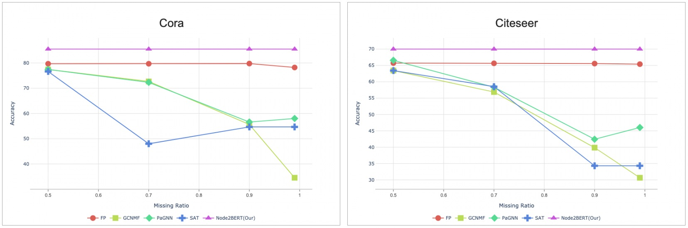

# Node2BERT
## Abstarct
Graph Neural Networks that allow learning on graphs with the structure and the feature information present state-of-the-art by solving diverse real-world problems. However, graph data in the real world often has poor attribute information, furthermore it contains distorted information. It is believed that topological information composed of the relationship between nodes and links in the graph includes the range expressed by the attribute. Therefore, It is necessary to construct a model that is robust to incomplete and absent attributes as well as distorted attribute information by learning the graph only from the structure. We propose Node2BERT, which performs representation learning only with the structure of graphs. Our model consists of a novel search bias model and a BERT model, which learns the graph structure as well as neighbor information. Node2BERT represents node relationships between 5 and 100 hops without performance degradation, furthermore it outperforms the existing baseline models. In addition, our model displays excellent performance when compared to a model using partial attribute information, and the performance gap widens as the attribute-missing ratio deepens.outperforms the existing models.
## Experiments
### Datasets
+ citeseer
+ cora
+ pubmed

| Dataset | Nodes | Edges | Features | Classes | 
| :---: | :---:| :---: | :---: | :---:|
| Citeseer | 3,327 | 4,732 | 3,703 | 6 | 
| Cora | 2,708 | 5,429 | 1,433 | 7 | 
| Chameleon	| 2,277 | 36,101 | 2,325 | 4 |


A is the adjacency matrix(adding **self-loops**), D is the degree matrix, X is the features, W is the parameters.
### Train
```
python pretraining_eval_ver.py --neighbor_epoch 5  --l "20" --bert_layer "6" --hidden_size 64 --block_size 64 --mlm_prob 0.5 --input cora --position True
```

### Node Classification
```
python node_classification_task.py --neighbor_epoch 5 --step 0 --N 1 --l "20" --bert_layer "6" --hidden_size 64 --block_size 64 --mlm_prob 0.5 --input cora --position True
```

### Experiment results
+ Accuracy (Attribute Missing)
  

+ Accuracy (Nomal Model)
    | Dataset | Deep Walk | Node2vec | GCN | GAT | Node2BERT(our)|
    | :------: | :------: | :------: | :------: | :------: | :------: |
    | Cora(%)	| 70.2 | 71 |	81.5 | 83 | 85.5 |
    | Citeseer(%)	| 51.3 | 47.3 | 70.3 | 72.5 |	70 |
    | Chameleon(%)	| 43.9 | 31.4 | 67.6 | 65 | 67.2 | 

## Refrence
https://github.com/ki-ljl/node2vec
